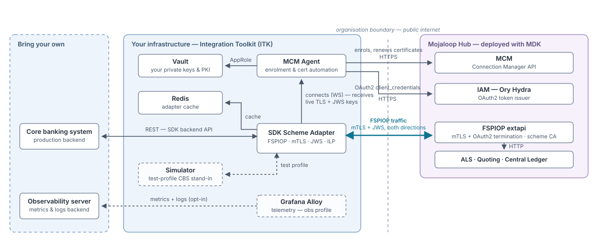

# Architecture

[README](../README.md) / Architecture

**Audience:** decision makers and architects evaluating the toolkit; operators who want the design context behind the deployment guides

This page explains what problem the Integration Toolkit solves, how it is put together, and why the approach is sound — the questions to answer *before* following the [integration guide](integration.md).

- [The problem](#the-problem)
- [The solution](#the-solution)
- [Why this approach](#why-this-approach)
- [Trust boundaries](#trust-boundaries)
- [Operational profile](#operational-profile)
- [Relationship with the ML Deployment Toolkit](#relationship-with-the-ml-deployment-toolkit)

## The problem

Connecting a financial institution to a Mojaloop scheme requires a specific set of moving parts on the participant's side:

- a **mutually-authenticated TLS** connection to the hub's FSPIOP API, in both directions — the participant dials the hub, and the hub dials the participant back;
- **JWS message signing** and signature verification on every FSPIOP message;
- **ILP packet, condition, and fulfilment** generation and validation;
- translation between the **asynchronous Mojaloop API** and the synchronous request/response style that core banking systems expect;
- an **automated PKI lifecycle** against the hub's certificate manager — CSR submission, signing, renewal, rotation;
- an integration path to the institution's **core banking system**.

Building these in-house means months of engineering against the FSPIOP, ILP, and JWS specifications, followed by a permanent maintenance burden as the specifications and the hub evolve. Getting any one of them subtly wrong — certificate rotation is the classic case — takes the connection down or introduces vulnerabilities.

## The solution

ITK packages those moving parts as a small, self-contained Docker Compose stack that a participant runs on its own infrastructure. One stack serves one participant.

| Component | Role | Why it is in the stack |
|---|---|---|
| **MCM Agent** | Enrols with the hub's Connection Manager, drives the certificate lifecycle, pushes live TLS material and JWS keys to the SDK over a WebSocket | Removes all manual certificate operations — the dominant failure mode of scheme connectivity |
| **Vault** | Generates and holds the participant's private keys and PKI state | Keys never exist outside the participant's infrastructure; the agent authenticates to it with AppRole only |
| **SDK Scheme Adapter** | Speaks FSPIOP, terminates mTLS in both directions, signs and validates JWS, handles ILP, adapts async scheme traffic to a synchronous backend API | The reference Mojaloop connector — the same component used across Mojaloop deployments, composed rather than reimplemented |
| **Redis** | The adapter's state cache | Required by the SDK for in-flight transfer state and callback correlation |
| **Simulator backend** *(test profile)* | Stand-in core banking system | Lets the participant bring the scheme connection fully live before the core-banking integration exists |
| **Grafana Alloy** *(obs profile)* | Ships metrics and logs to the participant's observability backend | Optional, opt-in |

Certificate rotation deserves the highlight: when the agent obtains new certificates, it pushes them to the running SDK over its control channel. **No restart, no traffic interruption, no operator action.**

## Why this approach

The points that matter when deciding whether to adopt the toolkit, rather than build or assemble the pieces in-house:

**The participant keeps custody of its keys.** Private keys are generated in the participant's own Vault and never leave its infrastructure; only CSRs cross to the hub. The OAuth2 client secret is generated by the participant and never held by the hub. For institutions with regulatory constraints on key custody, this is the property to check first — and it holds by construction, not by policy.

**Certificate operations are automated on the participant's side.** Enrolment, renewal initiation, and zero-downtime rotation are the agent's job, not a runbook's — the agent submits a fresh CSR on its own as expiry approaches and hot-swaps the signed result into the SDK. Each CSR still waits for the Hub operator's signature, so the cycle has one hub-side step; the participant-side requirement is simply that the agent is running, or renewal never starts.

**Proven components, not bespoke code.** The FSPIOP-speaking core is the Mojaloop SDK Scheme Adapter, maintained upstream and exercised across the Mojaloop ecosystem. ITK is composition and automation around it — the surface the participant maintains is configuration, not protocol code.

**One clean integration point.** The participant's core banking system sees a single synchronous REST API (the SDK backend API) and none of the scheme's complexity. The bundled simulator implements that same API, so go-live is a one-variable change (`BACKEND_ENDPOINT`) that touches nothing about enrolment, certificates, or connectivity — the scheme-facing side is proven before the core integration starts, and unaffected when it lands.

**Small operational footprint.** Docker Compose on a single VM. No Kubernetes, no orchestration platform, no dedicated team. The trade-off is deliberate: single-instance, not highly available — see [operational profile](#operational-profile).

**Observability stays with the participant.** The telemetry agent is a separate opt-in profile, and its backend is one the participant brings — any Prometheus remote-write and Loki pair, typically an existing observability server. Telemetry is participant-internal networking; nothing about it is visible to, or shared with, the hub.

**One hub contract.** The toolkit works against any Mojaloop hub exposing the FSPIOP and Connection Manager APIs. A hub deployed with the [ML Deployment Toolkit](https://github.com/mojaloop/ml-deployment-toolkit) (DTK) is the reference implementation of that contract — stated authoritatively in its [integration contract](https://github.com/mojaloop/ml-deployment-toolkit/blob/main/doc/architecture/participant-integration.md) — and the [integration guide](integration.md) uses its endpoint shapes as the worked example, valid for any compatible hub.

## Trust boundaries

The organisation boundary in the diagram is the load-bearing line: two organisations, each acting only on infrastructure the other cannot see.

| | The participant holds | The hub holds |
|---|---|---|
| **Keys** | Its private keys (in its Vault), its OAuth2 client secret | Its scheme CA, its own server keys |
| **Never crosses** | Private keys, client secret | CA private key |
| **Crosses outbound** | CSR, the participant CA bundle, the FQDN | — |
| **Crosses inbound** | — | The signed participant certificate, the hub CA bundle |

What this buys the participant:

- **The hub cannot impersonate a participant.** It never holds participant private keys or client secrets — the hub's own authorization model prevents even hub admins from reading participant credentials.
- **Compromise is compartmentalised.** A breach on either side does not yield the other side's key material.
- **All traffic across the boundary is mutually authenticated.** FSPIOP runs over mTLS with certificates chained to the scheme CA, plus per-message JWS signatures — transport *and* message-level integrity.

## Operational profile

What the stack asks of the participant's operations team in steady state:

| Keep alive | Because |
|---|---|
| The MCM Agent container | It initiates certificate renewal; if it is down, an expiring certificate will not renew |
| The DNS record | The hub reaches the participant by dialling its FQDN; the record must keep resolving to an address where the SDK's inbound `:443` is reachable. A static IP is the simplest way to guarantee that, but any setup that keeps the record accurate works |
| Backups of the Vault volume | It holds the participant's keys and PKI state; see the [recovery notes](integration.md#reference-notes) |

Everything else — enrolment, rotation, live reconfiguration of the SDK — is automatic.

**Deliberately single-instance.** The Vault file backend, the SDK's Redis cache, and the simulator all assume one replica on one host. This matches the target profile: a participant connection is low-throughput control-plane-heavy infrastructure, and a VM restart is an acceptable recovery mode — the agent resynchronises state from the hub on reconnect. Institutions needing HA should treat the compose file as the reference topology to re-platform, not scale in place.

## Relationship with the ML Deployment Toolkit

DTK and ITK are the two sides of one scheme:

- **DTK** is what the *hub operator* deploys and operates — the Mojaloop switch, the Connection Manager, IAM, and optionally a Tooling Cluster hosting the hub-side supporting services.
- **ITK** (this repository) is what each *participant* runs to connect to it.

The documentation splits along the same line. **This repository owns the participant journey end to end** — [integration](integration.md), [verification](verify.md), [operation](operate.md), and [known issues](known-issues.md). DTK owns the hub and the [integration contract](https://github.com/mojaloop/ml-deployment-toolkit/blob/main/doc/architecture/participant-integration.md) — the authoritative statement of the choreography and of everything that crosses the boundary. The tables in this repository's guides mirror the contract and cite the revision they were written against; the contract page lists those mirrors.
