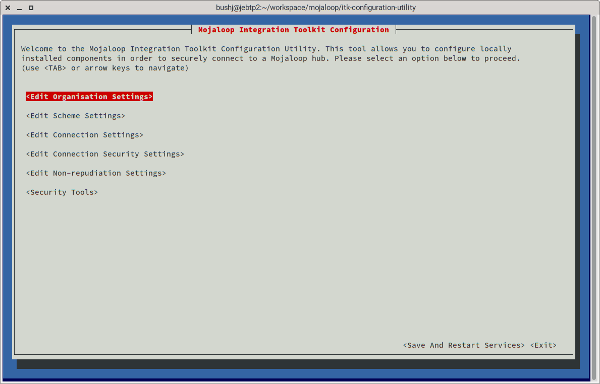
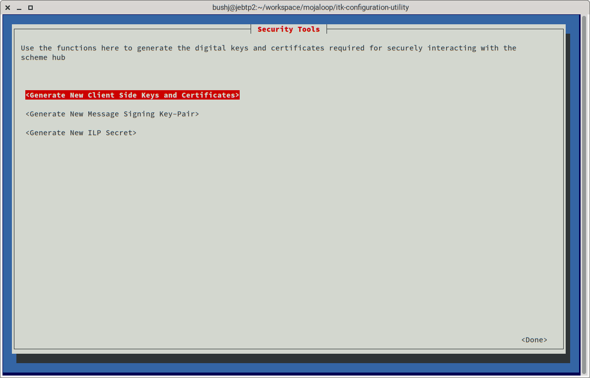
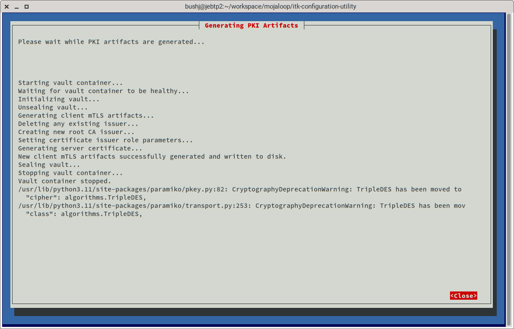
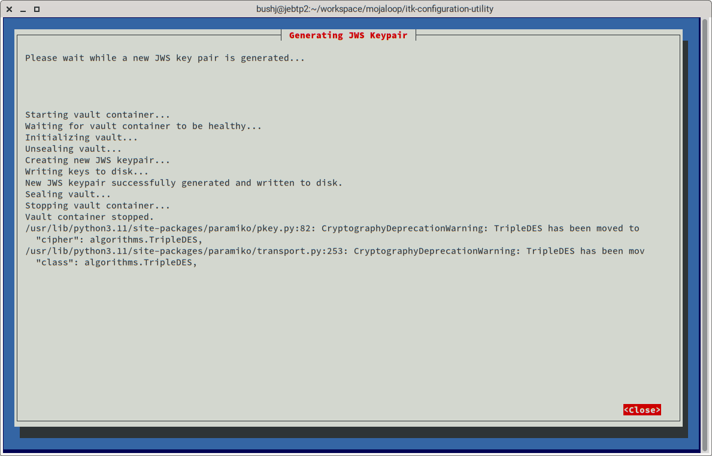

# Load Test

The artifacts in this repository facilitate load testing of ITK components.

## Scenario

The scenario provided simulates savings deposit transactions from mobile wallets to a small Microfinance institution.


Note that this procedure has only been tested on Fedora Linux 37. It should also work on similar Linux distrubutions,
mac and windows although you may encounter issues.

## Prerequisites

1. At least one suitable host machine running a recent version of either Linux, MacOS or Windows.
2. A recent version of docker "desktop" (the ability to create, run and manipulate docker containers from the command
   line).
3. Sufficient disk storage for all required docker images and test code.
4. A recent version of Node.js.
5. A recent version of git.
6. Sufficient RAM (on each host if using more than one) to run the required docker containers.

## Setup

You can run this test on a single host machine but to get realistic "real world" data it is best to run each of the
components on a separate host thus:

- **Host 3:** A Mojaloop connector and k6 load testing framework.
    - This simulates a Mojaloop hub and sending DFSP.
- **Host 2:** A Mojaloop connector and an Apache Fineract core connector.
    - This forms the "ITK" installation itself, acting as the interface between the core banking system of the receiving
      DFSP and the simulated Mojaloop hub.
- **Host 1:** A MifosX installation comprising a Postgres database, an Apache Fineract API server and the MifosX web
  portal
  user interface.
    - This represents the receiving DFSP core banking system.

Hosts 1 and 2 should be able to access each other across a network connection over TCP/IP using IPv4 addressing.

Hosts 2 and 3 should be able to access each other across a network connection over TCP/IP using IPv4 addressing.

It is easiest to have all three hosts connected via the same network but this is not strictly necessary.

If running this test across multiple hosts, be sure to note the DNS or hostnames of all three hosts. You will need
them later.

If running all the above on a single host machine it is necessary to run three concurrent terminal sessions.

## 1. Installing MifosX on Host 1

This test uses an instance of MifosX as a core banking systems for the MFI. The easiest way to install and run this is
via the Mifos provided docker compose scripts. These can be found in the Mifos GitHub organisation here:

[https://github.com/openMF/mifosx-docker](https://github.com/openMF/mifosx-docker)

_Note that this load test has only been performed against the postgres backed version, this is therefore the recommended
option._

1. Open a terminal session on host 1.
2. Clone the MifosX docker compose scripts:

```bash
$ git clone git@github.com:openMF/mifosx-docker.git
```

3. Change directory into the cloned repository:

```bash
$ cd mifosx-docker/postgresql
```

4. Start the services with the following command:

```bash
$ docker compose up
```

You should see the Apache Fineract API server, postgres database and MifosX user interface server containers start up
and log output to the terminal.

Note that the first time the containers start a database initialization procedure is run which can take several minutes
to complete. Wait until the output settles down to running background "cron" jobs before starting the test.

If you want to start from scratch again you can delete the postgres docker container and recreate it. This is easily
accomplished by running the following commands:

```bash
$ docker compose down
$ docker compose up
```

It is recommended NOT to change default settings except if you wish to access the Mifos portal from other hosts. See
Mifos documentation if you wish to do this.

## 2. Creating Test Accounts

In order to send funds to some test MFI customer accounts, we must create them.

Two mechanisms exist for creating Mifos clients and savings accounts. It is recommended to use the backend API mechanism
due to the complexities of preparing bulk import spreadsheets and manual configuration required.

#### Mifos Bulk Imoprt from MS Excel

You will need to manually create a savings account product, download some excel templates for clients and savings
accounts, complete them and upload them via the Mifos portal.

Please see bulk import documentation on Mifos
website [here](https://docs.mifos.org/mifosx/user-manual/data-import-tool).

#### Via Mifos Backend API

A node.js script `setupFineract.js` is provided to configure a vanilla installation of MifosX for receiving test savings
deposit transactions.

With node.js installed on your local machine, run the script:

```bash
$ node ./setupFineract.js
```

You should see a number of test clients and savings accounts get created. Check the console output for any errors.

You can also verify the client and savings accounts were created successfully via the MifosX user interface.

Note that the default username for logging on to the MifosX portal is "mifos" and the default password is "password".

## 3. Installing ITK Components on Host 2

### Install ITK Configurator Utility

1. Follow the installation instructions on the README here:

[https://github.com/mojaloop/itk-configuration-utility/tree/main](https://github.com/mojaloop/itk-configuration-utility/tree/main)

2. Test the utility has been installed correctly by running this command:

```bash
$ itkconfigurator
```

You should see the utility run in the terminal thus:



### Clone the ITK Repository to Host 2

1. Choose a location to install the ITK code, on a linux or mac machine, for testing purposes, it is sensible to put
   this in your users home directory to eliminate file permission issues; e.g. `~/mojaloopitk/`
2. `cd` into your new directory and clone the ITK repository thus:

```bash
$ git clone git@github.com:mojaloop/integration-toolkit.git
```

3. `cd` into the repository directory and then into the sub-directory `itk-minimal/resources`.

### Creating Cryptographic Keys and Certificates

> Note: For the purposes of this test, the certificate authority, client and server certificates, and JWS keys on both sides of
the Mojaloop connection will be identical. This would never be recommended in a production scenario but it means we only
need to generate a single set of keys. Both sides of the connection will still have to perform the same cryptographic
operations as if the keys and certificates were different. This has no effect on test results but allows us to
include the overhead of the cryptographic operations in our performance data.

#### Creating mTLS Certificates

1. Create a new sub-directory called "secrets" in the ITK directory
   e.g. `~/mojaloopitk/integration-toolkit/itk-minimal/resources/secrets`

2. Run the itkconfigurator utility:

```bash
$ itkconfigurator
```

3. Navigate (using <tab> or arrow keys) to the "Security Tools" button and press 'enter' to open the security tools
   page.



4. With the "Generate New Client side Keys and Certificates" button selected, press 'enter' again. You should see a
   sequence of messages printed to the screen showing the certificate generation process proceeding. When the process is
   complete close the window. Note that you can ignore any warnings about TripleDES algorithm having been moved in the
   vault API.



#### Creating Message Signing (JWS) Key-Pair

1. Navigate to the "Generate New Message Signing Key-Pair" button and press 'enter'. You should see a sequence of
   messages printed to the screen showing the JWS key-pair generation process proceeding. When the process is complete
   close the window. Note that you can ignore any warnings about TripleDES algorithm having been moved in the
   vault API.



### Configuring Mojaloop Connectors

1. Close the itkconfigurator utility if it is still open by returning to the main screen and selecting the 'Exit'
   button.
2.  

## 3. Setup Load Generation on Host 3

### Configuring the Load Generation Side Connector

### Configuring the ITK Side Connector


